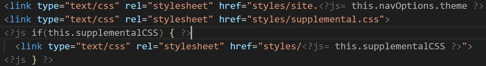

# Underscore Template Colorizer README

[`underscorejs`](https://underscorejs.org) is a common use javascript library which includes [compiled javascript html templates](https://underscorejs.org/#template).  This syntax colorizer is a simple extension of a stripped down version of sublime's html colorizer to provide some basic colorization to `underscorejs`'s embedded javascript tags.  Currently this extension targets `<?js ... ?>` format tags, following the pattern used in `jsDoc` templates (this literal is configurable in `underscorejs`).  Left unchanged are the original sublime template's rules which will recognize default `underscorejs` templates as "ruby" code.  This colorizer also includes patterns to "ignore" script tags with `type=text/template` (see [this discussion](https://stackoverflow.com/questions/9655039/sublime-text-2-recognize-underscore-templates-as-html/11886848#11886848)).

## Features

In addition to the "usual" scope names, this grammar generates the following additional names for `.tmpl` files (again matching `<?js...?>` tag patterns):

- `punctuation.definition.tag.html.embed.js` :  For the embedding js tags themselves.
- `punctuation.definition.string.begin.embedded`, `string.quoted.single.html.embedded`, `punctuation.definition.string.end.html.embedded` : For strings in an embedded js chunk.
- `punctuation.definition.tag.html.embedded.scope` : To colorize scope/control punctuation in an embedded js chunk.
- `punctuation.definition.tag.html.embedded` : All other embedded "punctuation" (e.g. operators, parens, etc.)
- `comment.line.double-slash.embedded.js`, `comment.block.embedded.js`, `comment.block.documentation.embedded.js` : Embedded comment body
    - `punctuation.whitespace.comment.leading.embedded.js` : leading white space for a comment
    - `punctuation.definition.comment.embedded.js` : The leading `//` for a comment
    - `storage.type.internaldeclaration.embedded.js` : @internal decl (honestly not familiar with this comment pattern)
    - `punctuation.decorator.internaldeclaration.embedded.js` : The `@internal` itself.
- `meta.embedded.js` : The entire body of embedded js chunks are tagged with this scope name.

## Usage

You can assign custom colors to the scope names generated by the grammar above by modifying your `settings.json`.

    "editor.tokenColorCustomizations": {
      "textMateRules": [
        {
          "name": "Tags",
          "scope": [
              "punctuation.definition.tag.html.embed.js"
          ],
          "settings": {
              "foreground": "#666"
          }
        }
      ]
    }

The complete color set used in the screenshot above is...

    "editor.tokenColorCustomizations": {
      "textMateRules": [
        {
            "name": "Tags",
            "scope": [
                "punctuation.definition.tag.html.embed.js"
            ],
            "settings": {
                "foreground": "#666"
            }
        },
        {
            "name": "Embedded Tags",
            "scope": [
            "punctuation.definition.tag.html.embedded"
            ],
            "settings": {
            "foreground": "#776"
            }
        },
        {
            "name": "Embedded Strings",
            "scope": [
            "string.quoted.single.html.embedded",
            "punctuation.definition.string.begin.embedded",
            "punctuation.definition.string.end.embedded"
            ],
            "settings": {
            "foreground": "#aaa"
            }
        },
        {
            "name": "Embedded Control Brackets",
            "scope": [
            "punctuation.definition.tag.html.embedded.scope"
            ],
            "settings": {
            "foreground": "#cc9"
            }
        },
        {
            "name": "Embedded JS Section",
            "scope": [
            "meta.embedded.js"
            ],
            "settings": {
            "background": "#111",
            "foreground": "#aaa"
            }
        },
        {
            "name": "Embedded Comments",
            "scope": [
            "comment.line.double-slash.embedded.js",
            "comment.block.documentation.embedded.js",
            "comment.block.embedded.js"
            ],
            "settings": {
            "foreground": "#aaccaa"
            }
        }
      ]
    }

## Known Issues

Listed below are my known issues for this project.  If you have a comment, suggestion, request or other input on this project, please ask a question or leave a comment on the [vscode marketplace page for this project](https://marketplace.visualstudio.com/items?itemName=Shinworks.tmplcolorizer).  If you encounter an issue, even one listed here, and would like to see it fixed, please go to the [github issues](https://github.com/Shizen/tmplcolorizer/issues) tracker and file an issue.  This project is very much in an "on demand" mode.  If there is no demand, only issues which bother me sufficiently in contrast to my available time will actually get addressed.

- This grammar provides only limited coloring for embedded js.
- The scope names employed may be inappropriate.
- This grammar currently identifies `<?js>` as the embedded js tag.  This [feature request](https://github.com/Microsoft/vscode/issues/61277) would allow "graceful" support for this issue.  Otherwise see my ["haxory"](#haxory) comment below.

## Hackory <a name="haxory" href="#haxory">#</a>

If you want to change the template characters (at least until vscode team implements [some variant of my suggestion](https://github.com/Microsoft/vscode/issues/61277)), you can go to ~line 523 in the `Underscore.tmLanguage` file and change the `<begin>` and `<end>` string patterns--`#embedded-js` is defined in the respository dictionary.

## Release Notes

### 0.0.7

- Improved this documentation

### 0.0.6

- Added support to recognize HTML-escaped values (oversight)

### 0.0.5

- Initial release

## License
[MIT](LICENSE.txt)